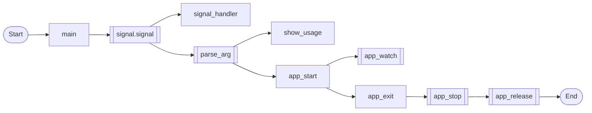
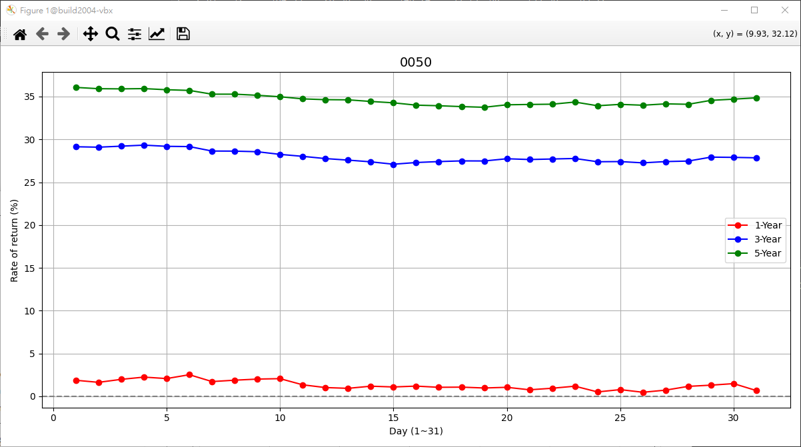
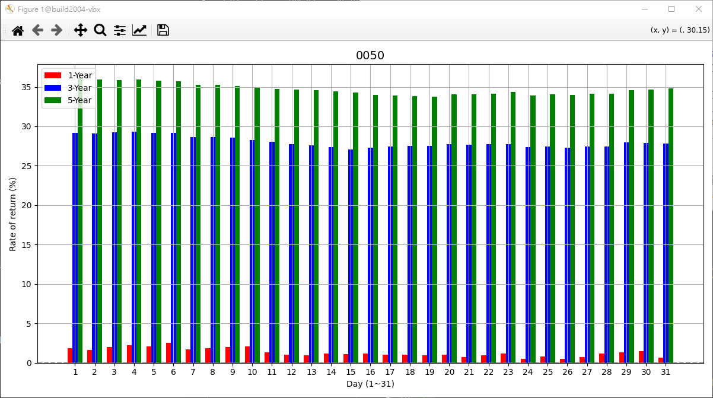

# 1. Overview

> pythonX9 把常用的工具集合在一起，並且將呼叫簡單化。

# 2. Depend on

#### - [ifaddr](https://pypi.org/project/ifaddr/)
#### - [matplotlib](https://pypi.org/project/matplotlib/)
#### - [netifaces (0.11.0)](https://pypi.org/project/netifaces/)
#### - [pandas](https://pypi.org/project/pandas/)
#### - [psutil](https://pypi.org/project/psutil/)
#### - [streamlink](https://pypi.org/project/streamlink/)

> This plugin does not support protected videos, try youtube-dl instead

# 3. Current Status

>不敢臭屁自己寫的有多完美，但是秉持著對 c 的嚴謹態度，至少能維持一定的水平的產出。
>
>雖然 python 入手容易，但是看到那些“不謹慎的成品”，並且掛上 AI 高手的名號，真的心生恐懼！


# 4. Build
```bash
Do nothing
```
# 5. Example or Usage

#### - dummy_123 - a template in python.


```bash
$ make dummy_123.py
or
$ ./dummy_123.py -d4
[8465/8465] dummy_123.py|app_start:0015 - (Python version: 3.8.10, chkPYTHONge(3,7,0): True, chkPYTHONle(3,7,0): False)
[8465/8465] dummy_123.py|app_start:0019 - (IFACE: enp0s3, IFACE_MAC: 08:00:27:33:73:52, IFACE_IPv4: 10.0.2.15)
[8465/8465] dummy_api.py|__init__:0020 - Enter ...
[8465/8465] dummy_api.py|ctx_init:0012 - Enter ...
[8465/8465] dummy_api.py|start:0029 - Start !!!
[8465/8465] dummy_api.py|parse_args:0025 - Enter ...
[8465/8465] dummy_123.py|app_release:0033 - Enter ...
[8465/8465] dummy_123.py|app_release:0038 - call dummy_ctx.release ...
[8465/8465] dummy_api.py|release:0009 - Done.
[8465/8465] dummy_123.py|app_release:0042 - Done.
[8465/8465] dummy_123.py|app_stop:0051 - Done.
[8465/8465] dummy_123.py|main:0103 - Bye-Bye !!! (is_quit: 1)

```
#### - httpd_123 - a simple Web Server

>負責接收檔案，並將內容存至 ./tmp。
>
>當初有人挑戰我，上傳檔案不能用 "PUT"。
>
>我就解釋給他說，當初 HTTP 剛流行時，上傳檔案，都是用 "PUT"。但不知何時，有的 HTTP Server 是用 "POST"，也有的 HTTP Server 是用 "GET"。
>
>說完這些這些，那位人士說我在唬爛。不過我還是要再教育他，不管是用 "PUT"、"POST" 和 "GET"，都只是 HTTP Server 方有沒有嫁接後面的處理程序，至於對錯只能在 SPEC 上說。
>
>因為你要對接的 HTTP Server不見得你能掌控。


```bash
$ ./httpd_123.py -p 8087
Serving HTTP on 0.0.0.0 port 8087 (http://0.0.0.0:8087/) ...
[httpd_123.py|do_POST:0062] - Enter ...
[httpd_123.py|dump_header:0022] - ** path **
[httpd_123.py|dump_header:0023] - /
[httpd_123.py|dump_header:0024] - ** headers **
[httpd_123.py|dump_header:0025] - Host: 192.168.56.104:8087
User-Agent: curl/7.68.0
Accept: */*
Content-Length: 46535
Content-Type: multipart/form-data; boundary=------------------------405c329812b65da4
Expect: 100-continue


[httpd_123.py|dump_header:0029] - ** Body /tmp/HTTPServer_ctx-3272277516 **
192.168.56.104 - - [19/Apr/2023 15:05:47] "POST / HTTP/1.1" 200 -

```

```bash
$ curl -d @endianness.jpg http://192.168.56.104:8087

$ gimp /tmp/HTTPServer_ctx-3272277516
```

#### - multicast_123.py - a multicast example.

```bash
$ make multicast_123.py
or
$ ./multicast_123.py -d4
[4977/4977] multicast_api.py|__init__:0110 - Enter ...
[4977/4977] multicast_api.py|ctx_init:0091 - Enter ...
[4977/4977] multicast_api.py|start:0119 - Start !!!
[4977/4977] multicast_api.py|parse_args:0115 - Enter ...
[4977/4978] multicast_api.py|serverx:0027 - bind ... (239.255.255.250:3618)
[4977/4978] multicast_api.py|readx:0045 - Run loop ...
[4977/4977] multicast_123.py|app_start:0025 - Send a packet every 2 seconds 239.255.255.250:3618.
[4977/4977] multicast_api.py|writex:0031 - send 239.255.255.250:3618 - b'1'
[4977/4978] multicast_123.py|notify_cb:0017 - buffer[1] - b'1'
[4977/4977] multicast_api.py|writex:0031 - send 239.255.255.250:3618 - b'2'
[4977/4978] multicast_123.py|notify_cb:0017 - buffer[1] - b'2'
[4977/4977] multicast_api.py|writex:0031 - send 239.255.255.250:3618 - b'3'
[4977/4978] multicast_123.py|notify_cb:0017 - buffer[1] - b'3'
[4977/4977] multicast_api.py|writex:0031 - send 239.255.255.250:3618 - b'4'
[4977/4978] multicast_123.py|notify_cb:0017 - buffer[1] - b'4'
^C[4977/4977] multicast_123.py|app_release:0042 - Enter ...
[4977/4977] multicast_123.py|app_release:0047 - call multicast_ctx.release ...
[4977/4977] threadx_api.py|threadx_wakeup:0033 - call notify ...
[4977/4978] multicast_api.py|closex:0021 - Done.
[4977/4978] multicast_api.py|threadx_handler:0079 - Bye-Bye !!!
[4977/4977] multicast_api.py|release:0088 - Done.
[4977/4977] multicast_123.py|app_release:0051 - Done.
[4977/4977] multicast_123.py|app_stop:0060 - Done.
[4977/4977] multicast_api.py|writex:0031 - send 239.255.255.250:3618 - b'5'
[4977/4977] multicast_123.py|main:0112 - Bye-Bye !!! (is_quit: 1)

```

#### - queuex_123.py - a queue and stack example.

>網路都只會介紹什麼是 queue，但是實際操作經驗零。這邊給你一個很好範例，特別是當你要操作TTY或是一些序列設備時，就會發現這有多好用。

```bash
$ make queuex_123.py
or
$ ./queuex_123.py -d4
[6822/6822] queuex_api.py|ctx_init:0094 - Enter ...
[6822/6822] queuex_123.py|queue_test:0024 - Push an integer every 10/1000 seconds. (is_stack: 0)
[6822/6822] queuex_123.py|queue_test:0028 - call queuex_push ... (idx: 1)
[6822/6822] queuex_123.py|queue_test:0028 - call queuex_push ... (idx: 2)
[6822/6822] queuex_123.py|queue_test:0028 - call queuex_push ... (idx: 3)
[6822/6822] queuex_123.py|queue_test:0028 - call queuex_push ... (idx: 4)
[6822/6822] queuex_123.py|queue_test:0028 - call queuex_push ... (idx: 5)
[6822/6823] queuex_123.py|exec_cb:0014 - (data: 1)
[6822/6823] queuex_123.py|exec_cb:0014 - (data: 2)
[6822/6823] queuex_123.py|exec_cb:0014 - (data: 3)
[6822/6823] queuex_123.py|exec_cb:0014 - (data: 4)
[6822/6823] queuex_123.py|exec_cb:0014 - (data: 5)
[6822/6822] queuex_123.py|queue_test:0028 - call queuex_push ... (idx: 6)
[6822/6823] queuex_123.py|exec_cb:0014 - (data: 6)
[6822/6822] queuex_123.py|queue_test:0028 - call queuex_push ... (idx: 7)
[6822/6823] queuex_123.py|exec_cb:0014 - (data: 7)
[6822/6822] queuex_123.py|queue_test:0028 - call queuex_push ... (idx: 8)
[6822/6823] queuex_123.py|exec_cb:0014 - (data: 8)
[6822/6822] queuex_123.py|queue_test:0028 - call queuex_push ... (idx: 9)
[6822/6823] queuex_123.py|exec_cb:0014 - (data: 9)
[6822/6822] queuex_123.py|queue_test:0028 - call queuex_push ... (idx: 10)
[6822/6822] queuex_api.py|ctx_init:0094 - Enter ...
[6822/6823] queuex_123.py|exec_cb:0014 - (data: 10)
[6822/6822] queuex_123.py|queue_test:0024 - Push an integer every 10/1000 seconds. (is_stack: 1)
[6822/6822] queuex_123.py|queue_test:0028 - call queuex_push ... (idx: 1)
[6822/6822] queuex_123.py|queue_test:0028 - call queuex_push ... (idx: 2)
[6822/6822] queuex_123.py|queue_test:0028 - call queuex_push ... (idx: 3)
[6822/6822] queuex_123.py|queue_test:0028 - call queuex_push ... (idx: 4)
[6822/6822] queuex_123.py|queue_test:0028 - call queuex_push ... (idx: 5)
[6822/6824] queuex_123.py|exec_cb:0014 - (data: 5)
[6822/6824] queuex_123.py|exec_cb:0014 - (data: 4)
[6822/6824] queuex_123.py|exec_cb:0014 - (data: 3)
[6822/6824] queuex_123.py|exec_cb:0014 - (data: 2)
[6822/6824] queuex_123.py|exec_cb:0014 - (data: 1)
[6822/6822] queuex_123.py|queue_test:0028 - call queuex_push ... (idx: 6)
[6822/6824] queuex_123.py|exec_cb:0014 - (data: 6)
[6822/6822] queuex_123.py|queue_test:0028 - call queuex_push ... (idx: 7)
[6822/6824] queuex_123.py|exec_cb:0014 - (data: 7)
[6822/6822] queuex_123.py|queue_test:0028 - call queuex_push ... (idx: 8)
[6822/6824] queuex_123.py|exec_cb:0014 - (data: 8)
[6822/6822] queuex_123.py|queue_test:0028 - call queuex_push ... (idx: 9)
[6822/6824] queuex_123.py|exec_cb:0014 - (data: 9)
[6822/6822] queuex_123.py|queue_test:0028 - call queuex_push ... (idx: 10)
[6822/6822] queuex_123.py|app_release:0049 - Enter ...
[6822/6824] queuex_123.py|exec_cb:0014 - (data: 10)
[6822/6822] queuex_123.py|app_release:0054 - call queuex_ctx.release ...
[6822/6823] queuex_api.py|threadx_handler:0083 - Bye-Bye !!!
[6822/6822] queuex_api.py|release:0091 - Done.
[6822/6822] queuex_123.py|app_release:0054 - call queuex_ctx.release ...
[6822/6824] queuex_api.py|threadx_handler:0083 - Bye-Bye !!!
[6822/6822] queuex_api.py|release:0091 - Done.
[6822/6822] queuex_123.py|app_release:0058 - Done.
[6822/6822] queuex_123.py|app_exit:0070 - Done.
[6822/6822] queuex_123.py|main:0120 - Bye-Bye !!! (is_quit: 1)

```

#### - statex_123.py - state machine example.

```bash
$ make statex_123.py
or
$ ./statex_123.py -d4
[7221/7221] statex_api.py|ctx_init:0178 - Enter ...
[7221/7221] statex_api.py|statex_push:0072 - (name: Idle)
[7221/7222] statex_123.py|exec_cb_Idle:0064 - (name: Idle)
[7221/7221] statex_api.py|statex_push:0072 - (name: CableLinked)
[7221/7222] statex_123.py|exec_cb_CableLinked:0054 - (name: CableLinked)
[7221/7222] statex_123.py|leave_cb_Idle:0067 - (name: Idle)
[7221/7221] statex_api.py|statex_push:0072 - (name: NetworkOn)
[7221/7222] statex_123.py|exec_cb_NetworkOn:0044 - (name: NetworkOn)
[7221/7222] statex_123.py|leave_cb_CableLinked:0057 - (name: CableLinked)
[7221/7221] statex_api.py|statex_push:0072 - (name: CloudConnected)
[7221/7222] statex_123.py|exec_cb_CloudConnected:0034 - (name: CloudConnected)
[7221/7222] statex_123.py|leave_cb_NetworkOn:0047 - (name: NetworkOn)
[7221/7221] statex_api.py|statex_remove:0109 - (name: NetworkOn)
[7221/7221] statex_api.py|statex_pop:0092 - (name: CloudConnected)
[7221/7221] statex_123.py|exec_cb_CableLinked:0054 - (name: CableLinked)
[7221/7221] statex_123.py|leave_cb_CloudConnected:0037 - (name: CloudConnected)
[7221/7221] statex_123.py|app_release:0109 - Enter ...
[7221/7221] statex_123.py|app_release:0114 - call statex_ctx.release ...
[7221/7222] statex_api.py|threadx_handler:0167 - Bye-Bye !!!
[7221/7221] statex_api.py|release:0175 - Done.
[7221/7221] statex_123.py|app_release:0118 - Done.
[7221/7221] statex_123.py|app_exit:0130 - Done.
[7221/7221] statex_123.py|main:0180 - Bye-Bye !!! (is_quit: 1)

```

#### - stockx_123.py - 利用股票的收盤價計算每月存股的報酬率

> 先從`臺灣證券交易所/證券櫃檯買賣中心`取得歷史收盤價，計算`日日存`的報酬率

> 分割計算
>
> ```python
> # stockx_api.py
> 
> stock_splits = [ ("0050", pd.Timestamp("2025-06-18"), 1/4) ]
> ```

> 短、中、長期報酬率設定
>
> ```python
> # stockx_123.py
> 
> argsX = {
> 	"stock_no": stock_no
> 	,"year_ago": year_ago
> 	,"delta": delta_days
> 	,"buy_short": 1
> 	,"buy_medium": 3
> 	,"buy_long": 5
> 	,"history_folder": f"./stock"
> 	,"renew": False
> 	,"text": False
> 	,"verbose": False
> }
> ```
>
> ```python
> # stockx_api.py
> 
> 	def parse_args(self, args):
> 		...
> 		self.buy_short = args["buy_short"]
> 		self.buy_medium = args["buy_medium"]
> 		self.buy_long = args["buy_long"]
> ```

```bash
$ ./stockx_123.py
Usage: ./stockx_123.py <options...>
  -h, --help
  -d, --debug level
  -s, --stock Stock symbol
  -y, --year N years ago
  -l, --delta N days ago
  -r, --renew
  -t, --text
  -v, --verbose
    0: critical, 1: errror, 2: warning, 3: info, 4: debug, 5: trace
```

```bash
$ make stockx_123.py
or
$ ./stockx_123.py -d4 -y 10 -s 0050
[7045/140650796029760] stockx_123.py|argsX_dump:0053 - {'stock_no': '0050', 'date_range': [2015, 2016, 2017, 2018, 2019, 2020, 2021, 2022, 2023, 2024, 2025], 'year_ago': 10, 'renew': False, 'verbose': False}
[7045/140650796029760] stockx_api.py|history_load_from_csv:0318 - Found !!! (./stock/0050_history.csv), Loading ...
Day 1-Year                  3-Year                  5-Year                  Sum
    (%)    count  average   (%)    count  average   (%)    count  average   (%)
1   1.87   12     185.19    29.14  36     146.08    36.07  60     138.64    67.08
2   1.63   12     185.62    29.09  36     146.13    35.92  60     138.79    66.64
3   1.98   12     185.00    29.21  36     146.01    35.9   60     138.81    67.09
4   2.24   12     184.51    29.33  36     145.87    35.93  60     138.79    67.50
5   2.07   12     184.82    29.19  36     146.03    35.8   60     138.91    67.06
6   2.52   12     184.02    29.16  36     146.06    35.72  60     139.00    67.40
7   1.72   12     185.45    28.64  36     146.65    35.28  60     139.45    65.64
8   1.88   12     185.17    28.63  36     146.66    35.28  60     139.45    65.79
9   2.01   12     184.93    28.56  36     146.74    35.15  60     139.58    65.72
10  2.06   12     184.85    28.25  36     147.10    34.98  60     139.76    65.29
11  1.34   12     186.16    28.02  36     147.37    34.73  60     140.02    64.09
12  1.02   12     186.75    27.76  36     147.65    34.64  60     140.11    63.42
13  0.93   12     186.91    27.58  36     147.87    34.62  60     140.13    63.13
14  1.18   12     186.45    27.38  36     148.11    34.43  60     140.33    62.99
15  1.09   12     186.62    27.1   36     148.42    34.27  60     140.50    62.46
16  1.19   13     186.43    27.3   37     148.19    34.0   60     140.78    62.49
17  1.05   13     186.69    27.41  37     148.07    33.93  60     140.86    62.39
18  1.07   13     186.65    27.49  37     147.97    33.83  60     140.97    62.39
19  0.97   13     186.85    27.48  37     147.98    33.75  60     141.05    62.20
20  1.05   13     186.68    27.74  37     147.68    34.04  60     140.74    62.83
21  0.76   13     187.23    27.65  37     147.79    34.08  60     140.70    62.49
22  0.94   13     186.89    27.71  37     147.72    34.11  60     140.67    62.76
23  1.18   13     186.46    27.77  37     147.65    34.36  60     140.41    63.31
24  0.51   13     187.69    27.39  37     148.09    33.93  60     140.86    61.83
25  0.78   13     187.20    27.41  37     148.06    34.09  60     140.69    62.28
26  0.47   13     187.76    27.26  37     148.24    33.99  60     140.79    61.72
27  0.72   13     187.30    27.41  37     148.07    34.15  60     140.62    62.28
28  1.16   13     186.48    27.47  37     147.99    34.1   60     140.68    62.73
29  1.3    12     186.23    27.93  35     147.46    34.56  56     140.20    63.79
30  1.48   12     185.90    27.9   34     147.49    34.7   55     140.05    64.08
31  0.67   7      187.40    27.85  21     147.55    34.85  35     139.89    63.37
(stock_no: 0050, final_price: 188.65)
[7045/140650796029760] stockx_api.py|buy_return_plot_lines_on_screen:0233 - Plotting lines ...
[7045/140650796029760] stockx_api.py|buy_return_plot_bars_on_screen:0264 - Plotting ...
[7045/140650796029760] stockx_123.py|main:0174 - Bye-Bye !!! (app_quit_get: 1)
```





#### - sysinfo_123.py - 查找主機系統資訊，每5秒刷新畫面

```bash
$ make sysinfo_123.py
or 
$ ./sysinfo_123.py -d 4
[8510/8510] sysinfo_api.py|__init__:0201 - Enter ...
[8510/8510] sysinfo_api.py|ctx_init:0190 - Enter ...
[8510/8510] sysinfo_api.py|start:0212 - Start !!!
[8510/8510] sysinfo_api.py|parse_args:0206 - Enter ...
[8510/8510] sysinfo_api.py|keyboard_recv:0151 - press q to quit the loop ...
[8510/8511] sysinfo_api.py|os_net_ipaddrs:0067 - lo - 127.0.0.1/8
[8510/8511] sysinfo_api.py|os_net_ipaddrs:0067 - lo - ('::1', 0, 0)/128
[8510/8511] sysinfo_api.py|os_net_ipaddrs:0067 - enp0s3 - 10.0.2.15/24
[8510/8511] sysinfo_api.py|os_net_ipaddrs:0067 - enp0s3 - ('fe80::7549:bd5f:d0ed:32cf', 0, 2)/64
[8510/8511] sysinfo_api.py|os_net_ipaddrs:0067 - enp0s9 - 192.168.56.104/24
[8510/8511] sysinfo_api.py|os_net_ipaddrs:0067 - enp0s9 - ('fe80::e6d1:c758:6c5c:4cbd', 0, 4)/64
[8510/8511] sysinfo_api.py|os_net_ipaddrs:0067 - docker0 - 172.17.0.1/16
[8510/8511] sysinfo_api.py|os_net_ipaddrs:0067 - enp0s8 - ('fe80::d49:8acb:9f1b:c4cf', 0, 3)/64
[8510/8510] sysinfo_api.py|sysinfo_show:0145 - (Python version: 3.8.10 (default, Mar 13 2023, 10:26:41) )
[8510/8510] sysinfo_api.py|syinfo_show_uname:0133 - (os_platform: Linux-5.15.0-67-generic-x86_64-with-glibc2.29)
[8510/8510] sysinfo_api.py|syinfo_show_uname:0134 - (os_system: Linux)
[8510/8510] sysinfo_api.py|syinfo_show_uname:0135 - (os_node: build20-vbx)
[8510/8510] sysinfo_api.py|syinfo_show_uname:0136 - (os_release: 5.15.0-67-generic)
[8510/8510] sysinfo_api.py|syinfo_show_uname:0137 - (os_version: #74~20.04.1-Ubuntu SMP Wed Feb 22 14:52:34 UTC 2023)
[8510/8510] sysinfo_api.py|syinfo_show_uname:0138 - (os_machine: x86_64)
[8510/8510] sysinfo_api.py|syinfo_show_uname:0139 - (os_processor: x86_64)
[8510/8510] sysinfo_api.py|syinfo_show_uname:0141 - (uname_result: uname_result(system='Linux', node='build20-vbx', release='5.15.0-67-generic', version='#74~20.04.1-Ubuntu SMP Wed Feb 22 14:52:34 UTC 2023', machine='x86_64', processor='x86_64'))
[8510/8510] sysinfo_api.py|keyboard_recv:0162 - press q to quit the loop ...
[8510/8511] sysinfo_api.py|sysinfo_show_watch:0095 - --------------------------------------------------------------------------------
[8510/8511] sysinfo_api.py|sysinfo_show_watch:0098 - (cpu_usage: [2.0, 0.0, 1.0, 0.0])
[8510/8511] sysinfo_api.py|sysinfo_show_watch:0099 - (cpu_loadavg: (0.14, 0.07, 0.06))
[8510/8511] sysinfo_api.py|sysinfo_show_watch:0100 - (cpu_count: 4)
[8510/8511] sysinfo_api.py|sysinfo_show_watch:0101 - (cpu_num: 1)
[8510/8511] sysinfo_api.py|sysinfo_show_watch:0103 - (cpu_freq: 2808.0, min: 0.0, max: 0.0)
[8510/8511] sysinfo_api.py|sysinfo_show_watch:0112 - (disk_usage: 17.4 %)
[8510/8511] sysinfo_api.py|sysinfo_show_watch:0114 - (mem_total: 8335757312 bytes, mem_usage: 16.1 %)
[8510/8511] sysinfo_api.py|sysinfo_show_watch:0118 - (battery: 78.0 %, secsleft: 00:00:00, AC: True)
[8510/8511] sysinfo_api.py|sysinfo_show_watch:0125 - (fans: {})
q[8510/8511] sysinfo_api.py|threadx_handler:0173 - Bye-Bye !!!
[8510/8510] sysinfo_api.py|release:0187 - Done.
[8510/8510] sysinfo_123.py|app_release:0031 - Enter ...
[8510/8510] sysinfo_123.py|app_release:0036 - call sysinfo_ctx.release ...
[8510/8510] sysinfo_123.py|app_release:0040 - Done.
[8510/8510] sysinfo_123.py|app_stop:0049 - Done.
[8510/8510] sysinfo_123.py|main:0107 - Bye-Bye !!! (is_quit: 1)

```
#### - youtube_123.py - a streamlink example.

>使用 streamlink  api 方式下載 youtube 影片

```bash
$ make youtube_123.py
==> python 3.12 - layer_python: /work/codebase/lankahsu520/pythonX9/python


==> python 3.12 - run: youtube_123.py
PYTHONPATH=/work/codebase/lankahsu520/pythonX9/python ./youtube_123.py -d 4
[10130/139874243954496] youtube_123.py|app_start:0033 - (Python version: 3.12.3, chkPYTHONge(3,8,0): True, chkPYTHONle(3,8,0): False)
[10130/139874243954496] streamlink_api.py|streams_urlparse:0031 - (stream_url: https://www.youtube.com/watch?v=a_9_38JpdYU)
[10130/139874243954496] streamlink_api.py|streams_urlparse:0032 - (urlparse: ParseResult(scheme='https', netloc='www.youtube.com', path='/watch', params='', query='v=a_9_38JpdYU', fragment=''))
[10130/139874243954496] streamlink_api.py|streams_choice:0051 - (quality: 240p / dict_keys(['audio_mp4a', 'audio_opus', '144p', '240p', '360p', '480p', '720p', '1080p', 'worst', 'best']))
[10130/139874243954496] streamlink_api.py|streams_savetofile:0080 - (filename: ./240p.mp4, chunksize:1024)
./240p.mp4: 37,503,875 bytes

[10130/139874243954496] streamlink_api.py|streams_streaming:0069 - Download complete !!!
[10130/139874243954496] youtube_123.py|app_release:0053 - Enter ...
[10130/139874243954496] youtube_123.py|app_release:0058 - call streamlink_ctx.release ...
[10130/139874243954496] youtube_123.py|app_release:0062 - Done.
[10130/139874243954496] youtube_123.py|app_exit:0075 - Done.
[10130/139874243954496] youtube_123.py|main:0125 - Bye-Bye !!! (is_quit: 1)

```

# 6. Documentation

> Run an example and read it.

# Appendix

# I. Study

# II. Debug

## II.1. [`trace`](https://docs.python.org/3/library/trace.html#module-trace) — Trace or track Python statement execution

```bash
# trace line by line
$ python3 -m trace \
	--ignore-dir=/usr/lib/python3.8 \
	--trace ./dummy_123.py -d4
```

# III. Glossary

# IV. Tool Usage

## IV.1. [eric](https://eric-ide.python-projects.org)

> 希望在 ubuntu 有 Python editor 且能 debug，不要求有強大的功能。
>
> eric 安裝方便，所以選擇此 IDE。

> Eric is a full featured Python editor and IDE, written in Python. It is based on the cross platform Qt UI toolkit, integrating the highly flexible Scintilla editor control. It is designed to be usable as everdays' quick and dirty editor as well as being usable as a professional project management tool integrating many advanced features Python offers the professional coder. eric includes a plug-in system, which allows easy extension of the IDE functionality with plug-ins downloadable from the net.
>
> Current stable version is eric7 based on PyQt6 (with Qt6) and Python 3.

```bash
$ sudo apt install -y eric
```

# Author

> Created and designed by [Lanka Hsu](lankahsu@gmail.com).

# License

> [pythonX9](https://github.com/lankahsu520/pythonX9) is under the New BSD License (BSD-3-Clause).
